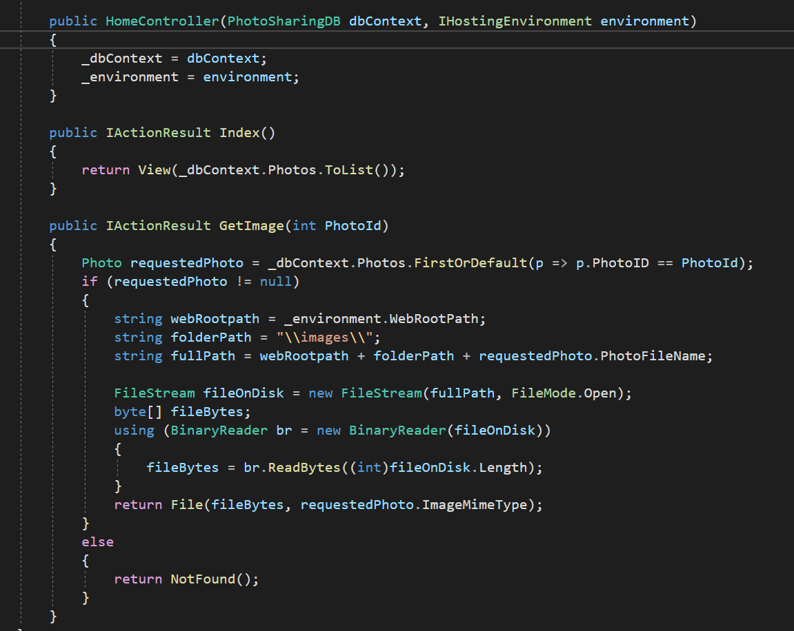
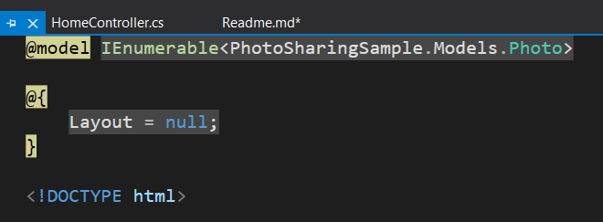
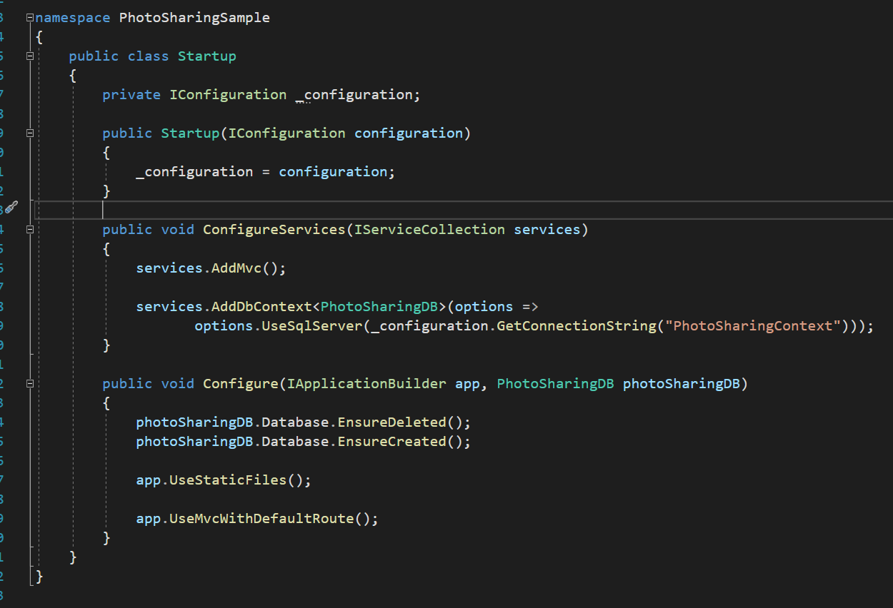
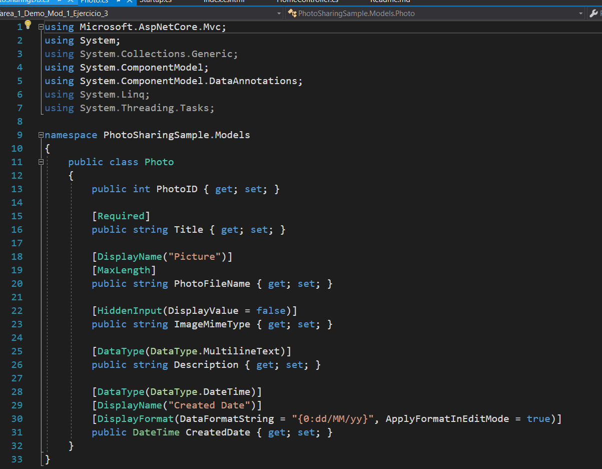

# Module 1: Exploring ASP.NET Core MVC
## Lesson 3: Introduction to ASP.NET Core MVC
### Nombres y apellidos:
Miguel Ángel Cabrero Luengo
### Fecha:
01/12/2020
### Resumen del Ejercicio:

#### Objetivo del ejercicio:
Revisar una aplicación ASP.NET Core MVC 

#### Tareas realizadas:

- Ejecución de la aplicación

- Revisar el código fuente en puntos clave

### Resultados de ejecución:

#### Resultado de ejecutar la aplicación:

#### Revisión de código de controladores:

#### Revisión de código de vista:

#### Revisión de código de inicio de la aplicación:

#### Revisión de código de modelo:

### Dificultad o problemas presentados y cómo se resolvieron:
No ha presentado problemas.

