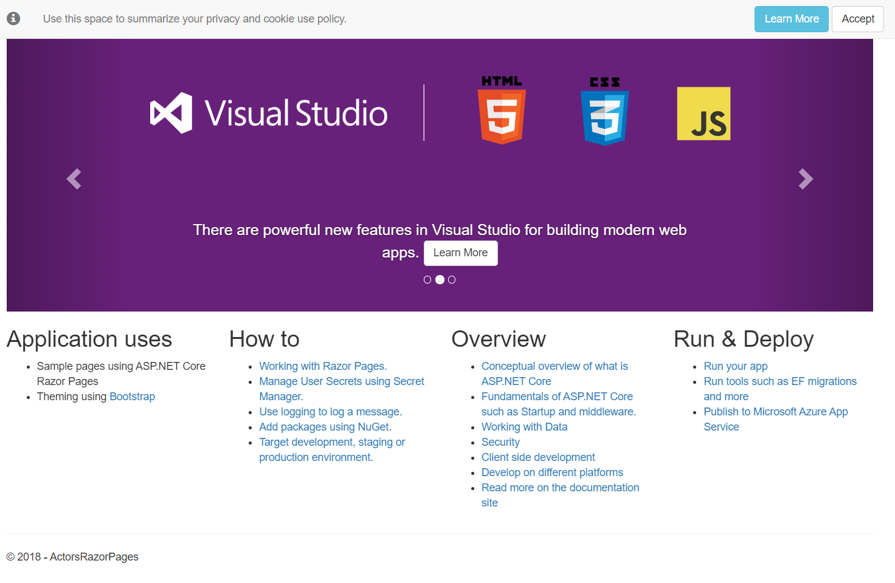
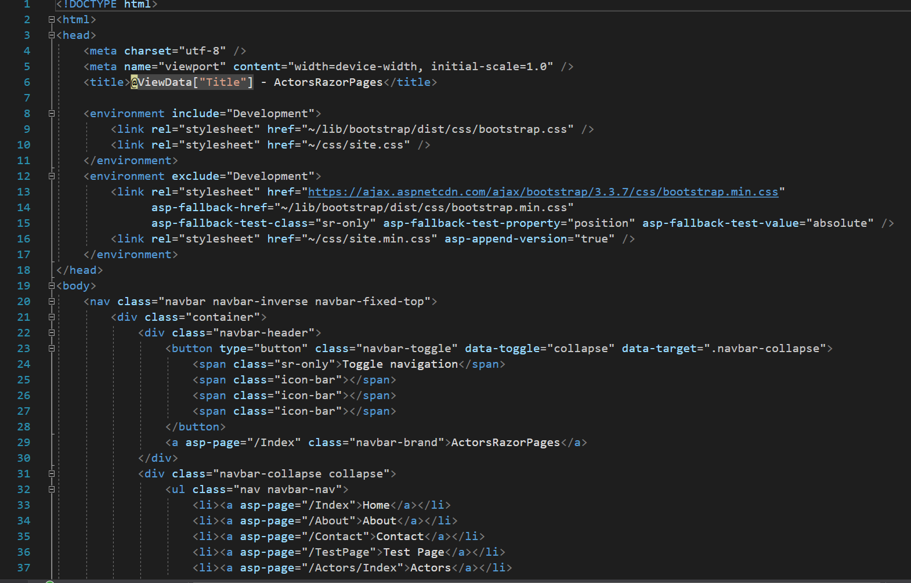
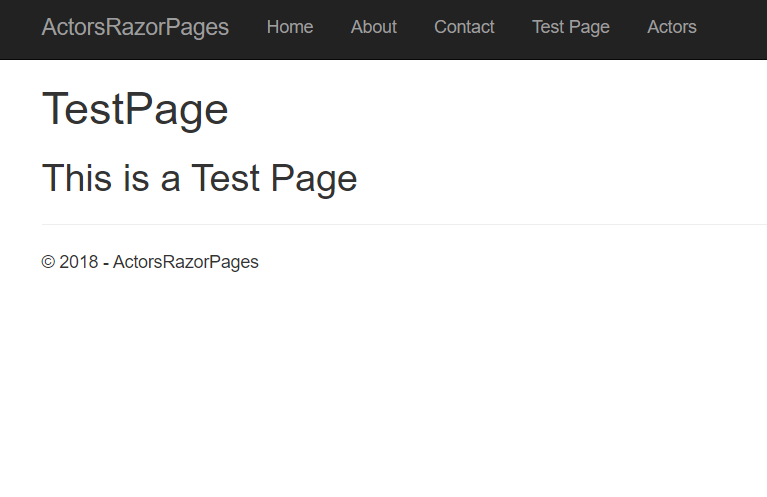
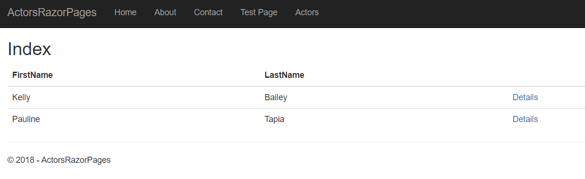

# Module 1: Exploring ASP.NET Core MVC
## Exercise 1: Exploring a Razor Pages Application
### Nombres y apellidos:
Miguel Ángel Cabrero Luengo
### Fecha:
01/12/2020
### Resumen del Ejercicio:

#### Objetivo del ejercicio:
Revisar una aplicación ASP.NET Core MVC 

#### Tareas realizadas:

- Ejecución de la aplicación

- Revisar la estructura de la aplicación

- Añadir funcionalidad básica de una página de test y una lista de actores

### Resultados de ejecución del ejercicio:

#### Resultado de ejecutar la aplicación:

#### Revisión de código de vistas:

#### Resultado de código test insertado:

#### Resultado de código lista de actores:

### Dificultad o problemas presentados y cómo se resolvieron:
No ha presentado problemas.

