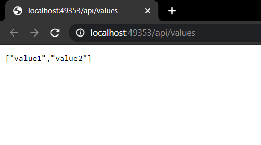
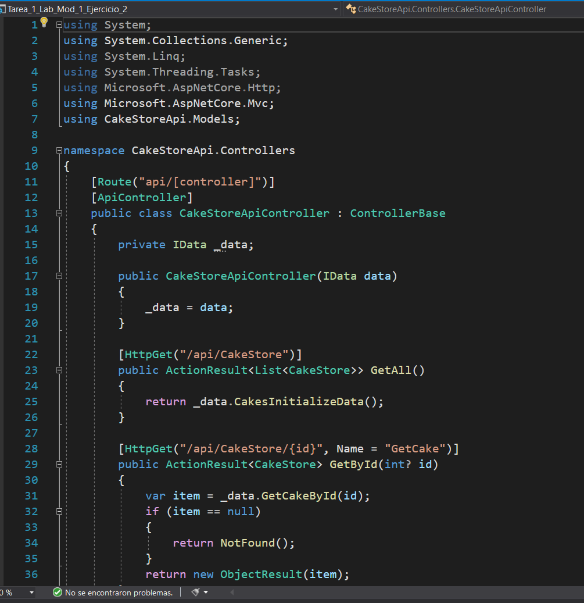

# Module 1: Exploring ASP.NET Core MVC
## Exercise 2: Exploring a Web API Application
### Nombres y apellidos:
Miguel Ángel Cabrero Luengo
### Fecha:
01/12/2020
### Resumen del Ejercicio:

#### Objetivo del ejercicio:
Revisar una aplicación Web Api

#### Tareas realizadas:

- Ejecución de la aplicación

- Revisar la estructura de la aplicación de los principales elementos del código

- Añadir funcionalidad básica. Obtención y visualización de elementos.

### Resultados de ejecución del ejercicio:

#### Resultado de ejecutar la aplicación:

#### Revisión y actualización de código de controladores:

### Dificultad o problemas presentados y cómo se resolvieron:
No ha presentado problemas.

