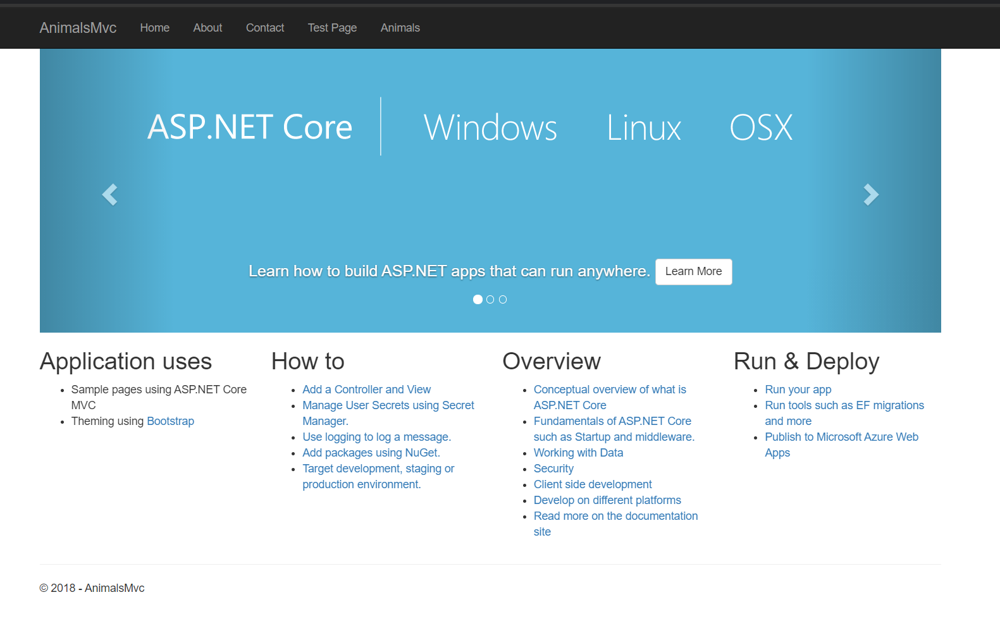
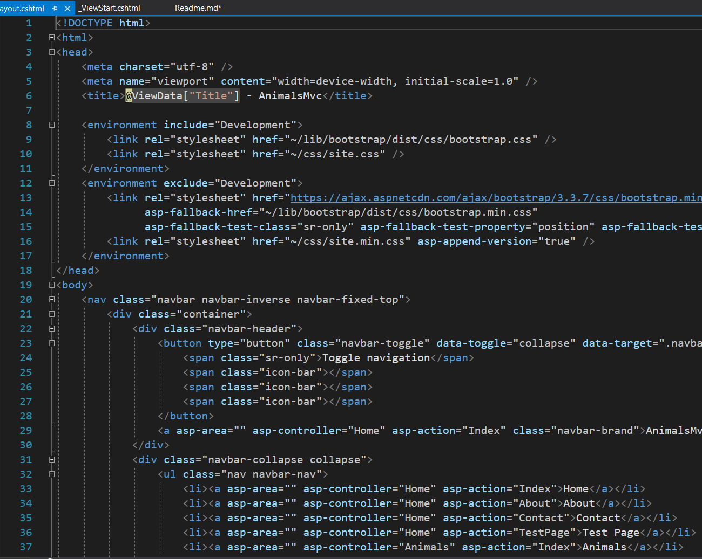
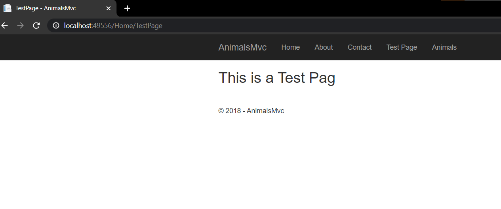
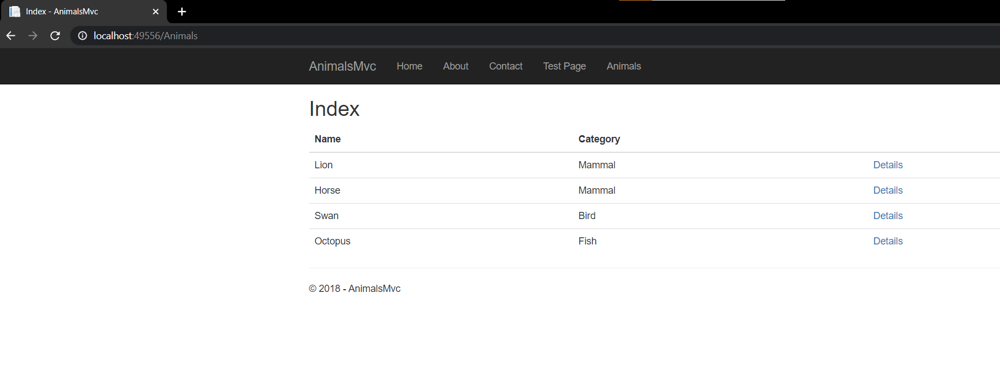

# Module 1: Exploring ASP.NET Core MVC
## Exercise 3: Exploring an MVC Application
### Nombres y apellidos:
Miguel Ángel Cabrero Luengo
### Fecha:
01/12/2020
### Resumen del Ejercicio:

#### Objetivo del ejercicio:
Revisar una aplicación MVC

#### Tareas realizadas:

- Ejecución de la aplicación

- Revisar la estructura de la aplicación de los principales elementos del código

- Añadir funcionalidad básica: Una página de test y obtención y visualización de animales.

### Resultados de ejecución del ejercicio:

#### Resultado de ejecutar la aplicación:

#### Revisión de código de vistas (Views):

#### Resultado de ejecutar funcionalidad test:

#### Resultado de ejecutar funcionalidad lista de animales:

### Dificultad o problemas presentados y cómo se resolvieron:
No ha presentado problemas.

